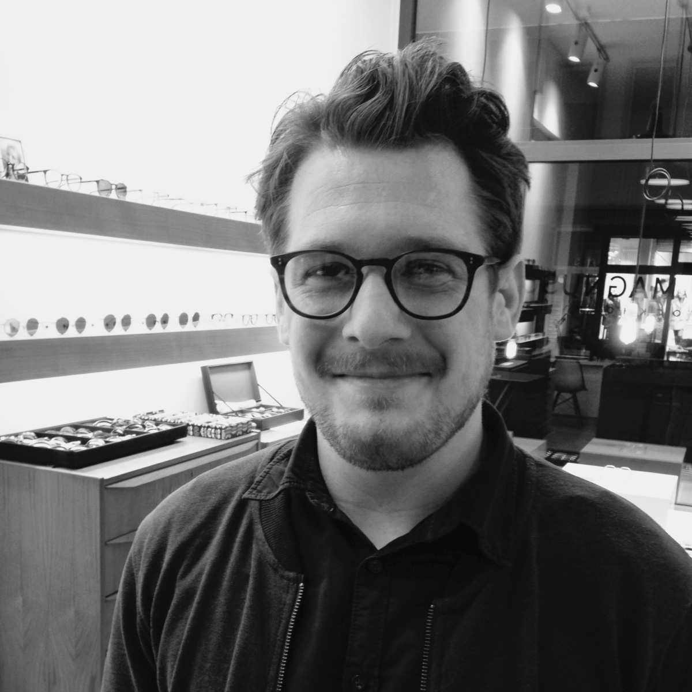

## 05 Jan N°01 Wie kommt ihr denn auf so eine Idee?

Viele von euch wollen natürlich wissen, warum und wie wir auf die Idee kamen unseren eigenen Verein zu gründen und uns nicht einfach bei einer größeren, bereits bestehenden Organisation zu engagieren. „Ist es nicht viel mehr Arbeit? Alleine die Infrastruktur, Organisation und Formalitäten müssen doch viel Zeit kosten?“ Nach eineinhalb Jahren hinarbeiten auf unser Ziel, mit Höhen und Tiefen, Zeiten in denen alles ganz schnell ging und Zeiten, in denen wir die Idee schon wieder fast aus unseren Köpfen verbannt hatten, müssen wir sagen: JA, es wäre weniger Arbeit gewesen, aber darum ging es uns nicht.

Um das zu erklären, möchten wir ganz vorne beginnen. Als wir im März 2015 in Nairobi ankamen, hatten wir eigentlich nur vor als Volunteers in einem Slum-Radio zu arbeiten und ein paar PR-Maßnahmen für Projekte vor Ort durchzuführen. Dort Leute zu treffen, die einen Teil unseres Lebens nachträglich und dauerhaft verändern würden, daran dachten wir damals nicht. Wir waren gespannt auf Kenia, Nairobi, die Lebensverhältnisse, die Arbeit und die Menschen, mit denen wir all dies erleben würden. Für uns war es ehrlich gesagt mehr Abenteuer und Reiselust, als der Gedanke daran nachhaltig Veränderung schaffen zu wollen. Doch unser Einsatz in Korogocho hat viel verändert – weit mehr für uns, als für die Menschen vor Ort. Dies ist unserer Versuch daran etwas zu ändern.

Jedoch muss zuerst erzählt werden, dass einiges anders lief als geplant – sonst wäre es wohl nicht Afrika. So arbeiteten wir zusätzlich zu dem Medienprogramm, für das wir eigentlich gekommen waren, auch noch in einem Children Rescue Center. Dieses hat es sich zur Aufgabe gemacht Kinder aufzulesen, die eigentlich in der Schule sein müssten, aber aus unterschiedlichen sozialen und finanziellen Gründen auf der 20 Quadratkilometer großen Müllkippe arbeiten, die sich zwischen Korogocho und Baba Dogo erstreckt. Um einen besseren Einblick in die Arbeit des Rescue Center zu erhalten, begleiteten wir die Mitarbeiter des Centers einen Tag lang bei der Suche auf der Müllkippe. Die Kinder, die wir dort trafen, hatten unterschiedliche Schicksalsschläge oder Erkrankungen in der Familie, meistens jedoch in Verbindung mit verzweifelter Armut. Dies veranlasste sie selbst oder ihre Familie dazu, die Suche nach Verwertbarem auf der Müllkippe einer Schulausbildung vorzuziehen.

Die Aufgabe an diesem Tag war simpel, aber höchst pikant. Die Kinder mussten identifiziert und in das Center eingeladen werden. Die Mitarbeiter erklärten uns, dass man zwar eine Einladung aussprechen, aber die erste aktive Entscheidung an dem Programm teilzunehmen von den Kindern kommen musste. Die Vorstellung eine solche, eventuell lebensverändernde Entscheidung im Alter von 8 oder 9 Jahren selbst treffen zu müssen und sein eigenes Leben aktiv zu verändern, konnten wir kaum nachvollziehen. Aber man erklärte uns, dass dieser erste Schritt der wichtigste sei, um einen erfolgreichen Verlauf des einjährigen Rehabilitation-Prozesses zu ermöglichen. Die Verantwortlichen oder Eltern der Kinder würde man später mit einbeziehen, wenn man von den Kindern ihre subjektive Situation erfahren und die Hauptprobleme identifiziert habe.

Auf diesem riesigen Berg von Abfällen zu stehen, auf dem nahezu menschengroße aasfressende Vögel sich mit Müllsammlern um Reste stritten und zu sehen, dass Kinder in einem Grundschulalter eine solch wichtige Entscheidung für sich und ihr Leben treffen mussten, löste in uns zwei zentrale Gedanken aus. Der erste war Dankbarkeit. Dankbarkeit dafür, dass unsere größte Sorge in diesem Alter war, vielleicht etwas länger aufbleiben oder etwas mehr vom Nachtisch essen zu dürfen. Auch wenn dies bei weitem nicht unsere erste Reise und schon gar nicht unsere erste Konfrontation mit Armut war, so wurde sie uns auf eine seltsam langsame und brutale Weise vor Augen geführt. Der zweite Gedanke war: Wie können wir helfen? Übermannt von den Zuständen denkt man zuerst daran jede Münze, die man dabei hat, weiterzugeben und hofft so etwas zu verändern. Die Rationalität schließlich besinnt einem eines Besseren.

Wenn es einen Schlüsselmoment gegeben hat, dann war es wohl dieser Tag. Doch helfen zu wollen und wirklich zu helfen sind zwei verschiedene Paar Schuhe. Das kann wohl jeder nachvollziehen, der einmal versucht hat Spenden zu sammeln. So formte sich zwar der Wille in uns, etwas zu ändern, doch wussten wir noch nicht wie und wann.

Der Plan und eine erste Vorstellung von unserem Projekt entstanden zusammen mit Peter und Monica. Die beiden und ihre Rolle für unser Projekt nur in einem Nebensatz zu erwähnen scheint ihnen nicht gerecht zu werden, daher werden wir uns in einem späteren Beitrag diesen außergewöhnlichen Charakteren widmen. Hier sei nur soviel gesagt, dass wir nach vielen Recherchen und Diskussionen beschlossen, dass unser Projekt nur in Zusammenarbeit mit engagierten Menschen vor Ort und aus der selben Lebensrealität, mit ähnlichen Problemen, wirklich erfolgreich sein konnte.

Aus groben Ideen wurde ein grober Plan. Wir wollten eine kleine Gruppe gründen, um kleine Fundraising-Projekte umzusetzen. Anfangen wollten wir, indem wir die bereits vielseitigen und bestehenden Projekte der Kenianer vor Ort nutzten, wie eben einem solchen Rescue Center. Kindern zu helfen, denen aus finanziellen Gründen der Zugang zu lebensverändernder Bildung verwehrt wird, obwohl es eigentlich um keine exorbitanten Summen geht, war das naheliegendste Anliegen. Wir wollten jedoch nicht nur Fundraiser, sondern auch Ansprechpartner, Motivator und Unterstützer sein. Hierfür war klar, dass ohne eine adäquate Betreuung vor Ort unser Projekt nicht so wirkungsvoll und nachhaltig sein würde wie wir es haben wollten. Unserem Grundsatz der „Hilfe von innen“ wollten wir gerecht werden. Wir helfen denen, die vor Ort helfen – das war unser Ziel. Somit wurden wir zu aktiven Mitarbeitern bei Smiles Africa Experience in Kenia, eine Organisation, die von Peter Mwashi Litonde – also genau dem selben Peter – gegründet wurde. Das Vertrauen und die rege Kommunikation zwischen Peter und Monica in Kenia und uns in Deutschland hat ermöglicht, dass wir mit viel Motivation im Gepäck und einigem Durchhaltevermögen andere für diese Idee gewinnen konnten und aus dem groben Plan unser gemeinsames Projekt entstehen konnte.

Ihr fragt euch wie kommt man auf so eine Idee? Wir sagen, weil wir tolle Leute getroffen haben, die aus unserer Idee ihre gemacht haben und damit Smiles Africa Deutschland in ein reales Projekt verwandelten. Wir sind sehr dankbar für unser Team und die vielen von euch, die uns unterstützen. Die Welt werden wir wohl kaum verändern, aber mit ein bisschen Glück und Anstrengung können wir nicht nur Bildung, Arbeitsplätze und Hoffnung entstehen lassen, sondern auch denen eine Zukunft geben, die vorher nicht einen Gedanken an den morgigen Tag verschwendet haben.

Julian
