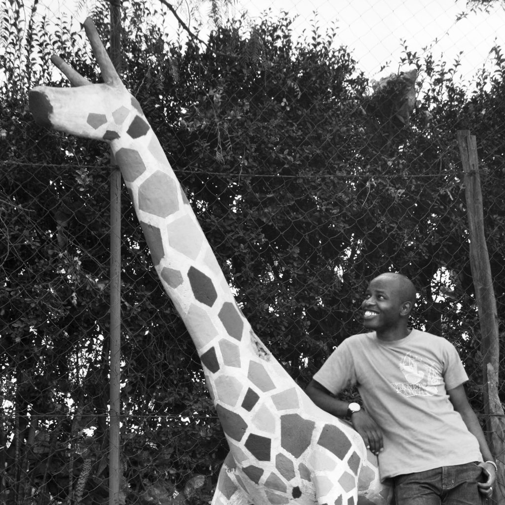

## 23 Aug N°03 African Child

African Child!  
Today is your day… Arise!  
You are an African child… Hope  
Dream and make your imagination true  
Walk tall African child, You belong!  
Read and lead the world
. You are free… Fly and become!  
Articulate your vison child, it is possible  
Step by step learn from your mistakes  
Forgive and let… Always strive for new heights  
Pray and play it is good for you child  
Dump the past and jump to the future  
Don’t shy to cry… try and try it will be  
Create and relate with your environment  
When it gets tough it may be hard to laugh… but still… Hope  
Keep the sweet memories in your heart  
Make and play your music… it is in us – Shake!  
In the midst of all, hold on to your discipline  
Respect the elders but cautiously so  
And when you get your own, tell them about Africa  
Tell your story… Our story – History  
Share the warmth of Africa  
Prove right our ideals  
Go and come back home… Africa  
Keep rising child – Represent with no fear  
Stay natural, you are beautiful…  
your skin glows and your strong hair affirms your identity  
Embrace peace, Shun hate and love freely  
Stay healthy… Eat from the fruits of our land  
With every sunrise in the amazing Africa… You are blessed  
In all your walks remember you belong to a Family… Stay close  
Above all, you are African! Africa is proud of you  
Shine your light! Be great!
