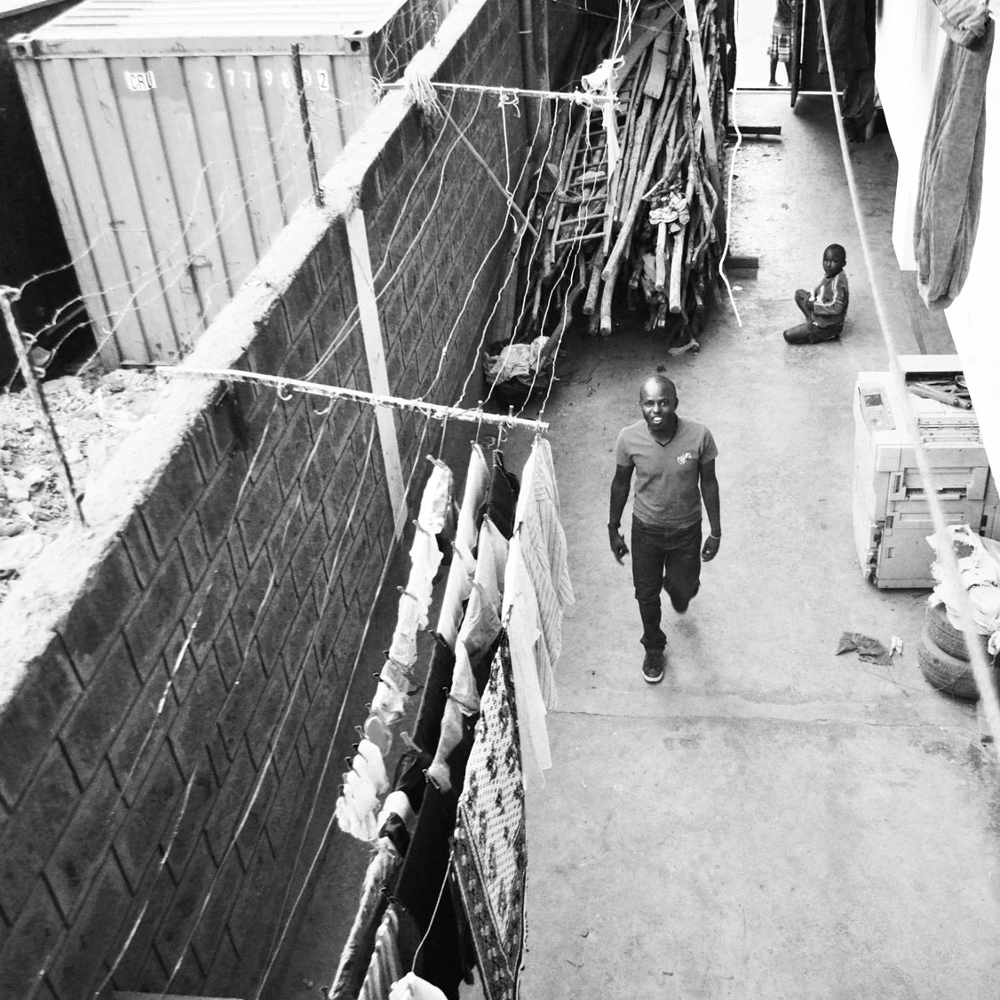
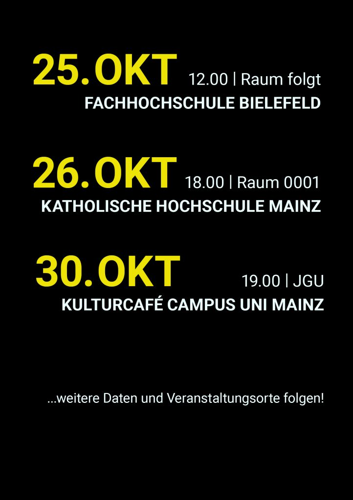

## 12 Okt N°04 Vortrag – Slum Empowerment

Peter Mwashi Litonde ist, wie viele von euch wahrscheinlich schon wissen, der Anfang von Smiles Africa. Er selbst wuchs im Slum Korogocho auf und initiiert als Community Developer seit seiner Jugend Projekte. Stets getrieben von seiner Ideologie fallen ihm immer wieder, teils auch sehr außergewöhnliche Projektideen ein, die das Leben der Menschen in Korogocho aufwerten und auf eine neue, bessere Zukunft hin lenken. Davon wird man angesteckt, es lässt einen nicht mehr los, man bekommt eine Idee davon wie man mit so wenigen Mitteln, die ein Slum zur Verfügung stellt, doch so viel bewirken kann!

Angesteckt hat Peter mit seiner Arbeit schon viele. So auch den Volunteer und Studenten Ravi. Dieser ist mit dem Versprechen Peter in Deutschland Gehör zu verschaffen nach seinem Volontariat zurück nach Deutschland geflogen – und hat sein Versprechen wahr gemacht. Durch den Kontakt Ravis zur Katholischen Hochschule in Mainz ist ein Vortrag ermöglicht worden – von Peter Mwashi Litonde, hier in Deutschland, zum Thema soziale Veränderung im Slum, die von innen heraus bewirkt wird.

Diese Chance haben wir uns nicht entgehen lassen und wollten euch die Möglichkeit geben mehr zu erfahren – über die Situation in Kenia, über unsere Arbeit, über all die Projekte, die schon etwas geändert haben, über das, was ihr so fleißig mit eurer Spende unterstützt!

Ganz ehrlich, leicht war es nicht. Das, was wir als so selbstverständlich erachten, einfach mit unserem Pass und fünfzig Dollar ein Visum und direkten freien Zugang zu einem so wunderschönen Land, wie Kenia, zu erhalten – das ist für einen Kenianer anders herum ein wahrer Hindernislauf. Angefangen bei all den Dokumenten, die man hier in Deutschland erst einmal besorgen muss, bis hin zu allem, was man dann unterschreiben und wofür man sich verpflichten muss. Die offizielle Einladung ist eine Sache und war schnell durch die Uni und uns als Verein erledigt. Der Aufwand, zu beweisen, dass unser Besucher das Land auch wieder verlässt, ist in unserer deutschen Bürokratie dann doch ein größeres Unterfangen. Danach das Warten, dass all die wertvollen Originaldokumente es durch das kenianische Postsystem schaffen und sicher in Peters Händen landen.

Die größere Hürde sollte aber dann erst folgen. Offensichtlich ist die Deutsche Botschaft in Kenia zur Zeit für einige Nachbarländer zuständig, sodass Menschen, die sich in Lebensgefahr befinden, hier ihre Visa beantragen und selbstverständlich Vorrang in der Terminliste finden. Pech für uns, denn Peter bekam den frühesten Termin erst in mehr als einem Monat. Viel telefonieren, viel aktivieren irgendwelcher Bekannter und Freunde, die irgendwie einen Draht zur Botschaft haben könnten, haben uns die letzten Tage viel Zeit und Nerven gekostet.

Doch manchmal hat man auch einfach Glück und Peter hat bei seinem stündlichen Checken der Terminlisten einen abgesagten und damit für ihn freigewordenen Termin gefunden. Man lerne daraus, nächstes Mal sehr viel früher mit all dem anfangen… Dank all der Arbeit, die unsere fleißigen Vereinsmitglieder geleistet haben, könnt ihr euch nun Peters Vortrag anhören, an folgenden Daten und folgenden Orten: Kommt vorbei!

